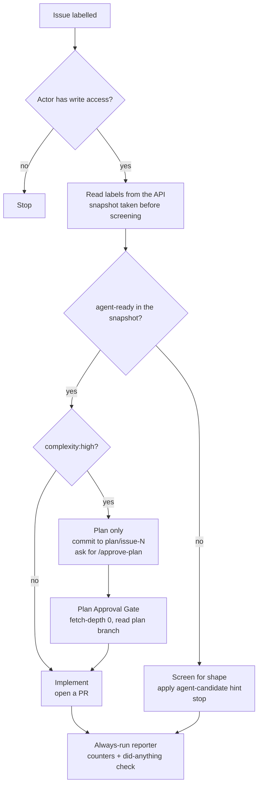
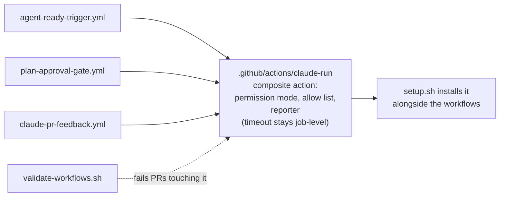
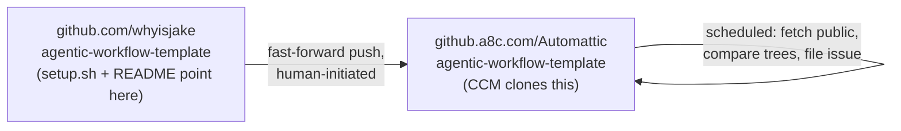

# Agentic Workflow Template - Beta Readiness - Plan

## Goal Capsule

- **Objective:** A customer who follows the README on a fresh repo gets a working agent — a labelled issue produces a pull request, and when it does not, the issue says why.
- **Means:** Land the six open draft PRs on the public repo in a conflict-tested order, build the three findings Jacob filed without a PR, then propagate the result to the enterprise copy through a repeatable sync path (KTD1, KTD6).
- **Authority:** Jacob's 20 August findings and the twelve `VIPPROD-104x/105x` issues define the defects. This plan decides sequencing and the two architecture calls he left open. Where a draft PR and this plan disagree, this plan wins for `U3`, `U5`, and the security corrections in `U2`; elsewhere the drafts are the implementation.
- **Stop conditions:** Stop and ask before merging anything into `github.a8c.com/Automattic` beyond a fast-forward. Stop if `U10` cannot produce a pull request on the test rig — that is the plan's proof, and shipping without it repeats the Beta claim that could not be reproduced.
- **Execution profile:** Merge-and-verify, not greenfield. Every unit except `U6`–`U8` and `U9`'s drift check is landing work that already exists; `U10` only verifies. Verification is a live agent run, not a unit test suite — this repo has no test runner.
- **Tail ownership:** This plan covers the template repo and the two remotes. The Parker/CCM/GOOP backend PRs and the GTM package stay with their own owners.

---

## Product Contract

### Summary

Fix the agentic-workflow-template so the `claude` path can open a pull request, so an issue reaches the agent the way the README says it does, and so a run that produces nothing explains itself. Land Jacob's six open drafts, build the three findings he deliberately did not PR, and put `whyisjake/agentic-workflow-template` and `github.a8c.com/Automattic/agentic-workflow-template` back in sync behind a mechanism that keeps them there.

### Problem Frame

The template was announced at Beta on 6 August with a 95%-first-pass claim resting on one end-to-end run, `whyisjake/fantasy#1`. Jacob tested it on a real repo across 17–19 August — two issues, ten agent runs — and found that as published the `claude` path cannot write a file at all. `permissions.defaultMode` set inside the action's `settings` input never reaches the SDK, so every write waits on an approval that cannot arrive in CI. Runs report success, produce nothing, and post no explanation.

The failure mode is silence. Four of Jacob's runs produced zero lines of code and the issue said nothing. In a customer's repo that costs confidence immediately — there is nothing to debug and nothing to report.

Two further defects sit upstream of the agent: routing reads a single label out of the event, so a `complexity:high` issue could skip the planning phase; and the documented way to start a run — letting the auto-labeler apply `agent-ready` — cannot work, because GitHub does not start runs from events triggered by `GITHUB_TOKEN`.

Tarun called the feature an alpha on 14 August pending this work.

### Key Decisions

- **Land in the public repo, then propagate to the enterprise copy.** *(session-settled: user-directed — chosen over deciding the canonical home first: the six drafts are already open against the public repo and the enterprise copy is a clean fast-forward behind it.)* Governs R14, R15.
- **The canonical-home question stays open.** `VIPPROD-1048` is a product/security call, not this plan's to make. The plan makes the split cheap to live with rather than resolving it. Governs R14.
- **Consolidate screening into the trigger rather than issuing a PAT.** Chosen over granting the auto-labeler a PAT or App token: a PAT in a customer's repo is a credential the customer must create, rotate, and scope, and it makes the labeler able to start an agent run by accident. Governs R6, R7.
- **Beta means one working provider.** The three stub providers stay stubs. The plan makes the dropdown honest rather than making three more agents work. Governs R13.

### Requirements

**The agent can do its job in CI**

- R1. The permission mode is passed through `claude_args`, in every workflow that invokes `anthropics/claude-code-action`.
- R2. The Bash allow list is the trust boundary between untrusted issue text and the runner. It covers read-only file and inspection commands, excludes any pattern that executes an arbitrary program or reaches the network, and the docs tell the customer that every entry they add is reachable by whoever can open an issue.
- R3. The job timeout is long enough for a real feature. Jacob's first successful run took 20m25s against a 15-minute cap.
- R4. A cancelled run reports itself. A timeout is a cancellation, not a failure, so a reporter gated on `failure()` alone stays skipped and the issue says nothing.
- R17. A workflow file that does not parse cannot land. GitHub schedules no job from a file it could not read, so the failure is silent by default.
- R18. An agent cannot widen its own permissions. Every file that defines the permission mode, allow list, or timeout is protected from agent-authored change the way `.github/workflows/` already is.

**How an issue reaches the agent**

- R5. Routing reads the issue's labels from the API, not from the single label carried on a `labeled` event.
- R6. Every documented way to start a run actually starts one, or the docs say plainly that it does not.
- R7. A run starts only from a `labeled` event that applied `agent-ready` itself, and whose actor has write access. A stale label on rewritten issue text starts nothing, and neither does a different label landing on an issue that already carries `agent-ready`.

**A run's outcome is legible**

- R8. The job summary carries the run's counters — turns, cost, and permission denials — from the SDK result.
- R9. A run that ends having changed nothing posts a comment on the issue saying so.
- R10. The readiness check accepts a hand-written issue whose opening heading is not spelled `## Summary`.

**Setup is honest about prerequisites**

- R11. Installing the Claude GitHub App is a documented setup step, and its absence produces a failure message that names it.
- R12. `setup.sh` installs from a configurable source and prints which source it used before it writes anything.
- R13. `setup.sh` sets `AGENT_PROVIDER` and states that the provider secret is the customer's to add. Selecting any provider other than `claude` is surfaced as unimplemented at setup time, and a run under one exits with a message naming it unavailable in Beta.

**The two copies stay in sync**

- R14. The enterprise copy carries the pinned action SHAs, `dependabot.yml`, and every fix in this plan.
- R15. A repeatable mechanism reports when the two copies diverge, so a two-PR drift cannot go unnoticed again.

**Proof**

- R16. The claim that a labelled issue produces a pull request is backed by a run on the test rig, on the template as it stands after this plan.

### Scope Boundaries

**In scope:** `whyisjake/agentic-workflow-template`, `github.a8c.com/Automattic/agentic-workflow-template`, and verification runs on `smithjw1/vip-workflow-cycling-desk`.

**Out of scope — other owners:**

- The Parker/CCM/GOOP backend PRs (`vip-go-api#7369`, `#7621`, `vip-customer-codebase-manager#949`, `vip-dashboard#5245`). `U9` changes what CCM clones; it does not change CCM.
- Pricing, packaging, tier confirmation, customer docs, and Pendo. GTM owns those.
- SDK v2 conformance for the integration.

**Deferred to follow-up work:**

- Making the three stub providers work (`VIPPROD-1051`). `R13` makes the dropdown honest; it does not implement Codex, Copilot, or custom.
- A screener that reads an issue's content and comments with questions to fill structural gaps. Jacob raised it as a v2 idea; `R10` only widens the structural check.
- Deciding where the canonical template lives (`VIPPROD-1048`).

### Open Questions

- **Blocking `U8`, from a live run on 21 August:** the auto-labeler can cause a run after all. An issue created carrying a `complexity:` label fires a `labeled` event; the auto-labeler concurrently applies `agent-ready`; the trigger reads labels from the API, sees it, and executes. The labeler's own event starts nothing — it makes a *concurrent* event's read succeed. This also defeats the write-access gate, because the triggering actor is whoever opened the issue. `U8` must gate on the label carried by the triggering event, not only on a pre-screening API read.
- **Blocking `U9` only:** does the enterprise repo accept a push from this working tree, and does the `sync/upstream-2026-08-14` branch already there conflict with the merged result? Resolve by attempting a dry-run push before opening `Automattic#1`'s replacement.
- **Deferred:** should `U8` remove `issue-screener.yml` entirely once screening moves into the trigger, or keep the weekly sweep for issues nobody labelled? Decide during `U8` from what the consolidated trigger actually covers.
- **Deferred:** whether `whyisjake/fantasy#1` is worth a root-cause investigation (`VIPPROD-1049`) once `U10` proves the fixed template works. A green run may make the question academic.

### Sources

- Jacob's findings comment, 20 August: `https://vipproductp2.wordpress.com/2026/08/06/agentic-workflow-→-beta-and-handing-off-to-gtm-tier-3/#comment-3294`
- Linear project and its twelve issues: `https://linear.app/a8c/project/cms-agentic-workflow-integration-5db3fe40661a`
- Draft PRs `#10`, `#11`, `#12`, `#13`, `#15`, `#16` on `whyisjake/agentic-workflow-template`
- Test rig with two worked issues and two agent PRs: `https://github.com/smithjw1/vip-workflow-cycling-desk`

---

## Planning Contract

### Key Technical Decisions

KTD1. **Land the drafts as merges, not as re-authored commits.** *(session-settled: user-approved — chosen over re-implementing the fixes: Jacob's commit messages carry the observed-run evidence for each change, and re-authoring discards the provenance.)* Governs R1–R5, R11–R13.

KTD2. **Merge order is `#10, #11, #15, #16, #13, #12`.** Re-measured after `U3` landed its corrections: `#13` conflicts in `.github/workflows/agent-ready-trigger.yml`, `README.md`, `docs/AGENTIC_DEVELOPMENT.md`, and `scripts/setup.sh`; `#12` conflicts in `.claude/settings.json`, `.github/workflows/agent-ready-trigger.yml`, and `.github/workflows/plan-approval-gate.yml` — seven conflicted files across two merges, up from five before the security corrections landed. All additive; none change intent. Two conflicted *merges* is the observed floor across six orderings tried — four PRs touch that one file, so some overlap is unavoidable. Putting the two clean setup PRs first and the headline fix third means a conflict never blocks `R1`. The recorded conflict list is directional, not a transcript: `U3` adds a correction commit to the same file, so `U3` re-runs the test-merge and updates this list before `U4` starts.

KTD3. **Every draft is audited before it merges, and `#16` lands with corrections.** *(session-settled: user-directed — chosen over merging the drafts on trust: an audit of one draft found two live regressions, so a one-in-six audit rate with a 100% hit rate is not evidence the other five are clean.)* Each merging unit reads its draft's full diff for guards removed, event types widened, and gates loosened, and records what it found. The audit of `#16` found two:
  - It removes the `github.event.label.name == 'agent-ready'` guard from the three stub-provider jobs without adding the API-labels check that replaces it in the `claude` job. Combined with the widened event list, those jobs would fire on every issue opened or edited.
  - It adds `edited` to the trigger's event types. `KTD5` resolves this.

KTD4. **The trigger accepts only `labeled` events from actors with write access.** *(session-settled: user-directed — chosen over keeping `edited` behind a loop guard: the loop was the lesser problem.)* Dropping `edited` closes a hole the source feedback did not name — any outside contributor whose issue once earned an `agent-ready` label could rewrite the issue body and re-fire the agent with new instructions, under `contents:write`. A stale label must not authorize a run on text it never covered. `opened` is likewise excluded: an issue author can fire it without write access. Governs R7.

KTD5. **The shipped allow list excludes anything that executes an arbitrary program or reaches the network.** *(session-settled: user-directed — chosen over merging `#15`'s allow list as authored: `Bash(xargs *)` and `Bash(find *)` both run arbitrary programs via `xargs sh -c` and `find -exec`, and `Bash(curl *)` adds egress to any host.)* Issue bodies are attacker-controlled prompt input and the agent runs with `acceptEdits`, so the allow list is the trust boundary, not a convenience list. The read-only file utilities from `#15` stay; customers add their own test and lint commands knowingly. Governs R2.

KTD6. **The permission mode and allow list become a single composite action under `.github/actions/`; the timeout stays at job level.** Chosen over a reusable workflow, a generated file, or a shared settings file referenced by path: four copies of the same JSON live across three workflow files today, and the drift Jacob observed already happened once. The settings-file option was rejected because `U2` established that the `settings` input does not reach the SDK, so the permission mode would still have to travel separately through `claude_args` — leaving the definition split across two mechanisms, which is the problem being solved.

  The timeout cannot come along: GitHub Actions does not support `timeout-minutes` on a step inside a composite action, and `#15`'s 30-minute cap is job-level in all three workflows. It stays duplicated, and the Verification Contract checks the three values match rather than pretending one definition exists.

KTD7. **Files that define the agent's permissions are protected the way `.github/workflows/` is.** `KTD6` moves the permission mode and allow list to a path the App token's missing `workflows` scope does not cover, so after the extraction an agent could open a PR widening its own allow list and it would read as ordinary refactoring. The validator from `U5` fails any PR touching those paths. Governs R18.

KTD8. **Run legibility is built on the action's execution-log file, read by a step that always runs.** `anthropics/claude-code-action` at the pinned SHA exposes no `result` output — its outputs are `conclusion`, `execution_file`, `branch_name`, `github_token`, `structured_output`, and `session_id`. The counters live inside the JSON that `execution_file` points at. Observed in a live run on 21 August: the final `result` record carries `num_turns`, `total_cost_usd`, and `permission_denials_count` as a scalar — read them directly, do not compute a length.

  An `if: always()` step runs on the cancellation path `R4` names, but the Claude step is killed mid-write there, so the file may be truncated or absent. The reporter falls back to a "run cancelled before it reported" summary rather than failing — a missing file is itself the signal.

KTD9. **The drift check runs on the enterprise copy, not the public one.** *(session-settled: user-approved — chosen over an automatic mirror push: an automatic push would silently pick a winner while `VIPPROD-1048` is open.)* The direction is load-bearing: a public runner cannot reach `github.a8c.com`, so a public-side check can only compare the public tree against a manifest of itself and would report in-sync while the enterprise copy drifts. An enterprise runner can reach `github.com`, so that is the only side from which both trees are visible. Governs R15.

### High-Level Technical Design

Directional only — the implementer picks the exact step shapes.

How an issue reaches the agent, after `U3` and `U8`:

Two properties make this safe, and both are load-bearing. The label snapshot at `C` is taken **before** the screening step runs, so a label the screener applies in the same run can never satisfy the gate at `D` — otherwise any well-formed issue from any user would start a paid run. And the screener applies `agent-candidate`, not `agent-ready`: GitHub emits no `labeled` event for a label already present, so a screener that applied `agent-ready` directly would leave a human no way to start the run.

Where the permission block lives after `U6` and `U7`:

Two-repo topology after `U9`:

### Assumptions

- `anthropics/claude-code-action` at the pinned SHA `239e3a7` still reads `--permission-mode` from `claude_args`. Jacob verified this on 17–19 August; `U2` re-verifies it as a side effect of its own run.
- Both remotes are configured (`origin` and `a8c`, with `all` as a push alias covering both) and `git fetch a8c` succeeds today.
- The enterprise repo can run scheduled GitHub Actions and reach `github.com` from its runners. `U9` verifies this before relying on it; if it cannot, `R15` needs a different mechanism and `U9` stops and asks.
- No CI test suite exists in this repo. `validate-workflows.yml` from `#12` is the first automated check the repo will have; verification otherwise means running the agent.

### Sequencing

`U1` → `U2` → `U3` → `U4` → `U5` are strictly ordered: each is a merge onto the result of the last, and `KTD2`'s conflict analysis only holds for that order. `U5` ends with a baseline end-to-end run that `U6` diffs against.

`U10` moves ahead of `U9`. The proof does not depend on the enterprise sync, and `U9` carries a stop-and-ask gate this plan does not control — sequencing the proof behind it risks the plan producing no evidence at all, the one outcome the Goal Capsule calls fatal. `U9` ends with a short re-run confirming the sync changed nothing.

Order: `U1` → `U2` → `U3` → `U4` → `U5` → `U6` → `U7` → `U8` → `U10` → `U9`.

`U3` and `U8` both touch `auto-label-agent-ready.yml`: `U3` widens its structural check, `U8` folds it into the trigger. That is deliberate — `U3` has to ship a working labeler because `U8`'s consolidation is the architecture call, and this plan lands the bug fixes before the architecture change.

### Risks and Dependencies

| Risk | Mitigation |
|---|---|
| `U3`, `U4`, and `U5` change PRs Jacob authored, so his review evidence no longer matches the merged code. | Correct in follow-up commits on each merge, not by rewriting his commits, and say why in the commit message. Report the corrections back on the PR threads. |
| `U6` touches every workflow the customer runs. A mistake here breaks all three paths at once. | `U5` ends with a baseline end-to-end run; `U6` diffs its effective configuration against that run and re-executes the same case afterwards. |
| The whole verification path depends on one repo owned by a third party. Losing access to `smithjw1/vip-workflow-cycling-desk` invalidates six units' proof. | `U10`'s fresh-scratch-repo scenario is owned by this team and does not depend on the rig. Treat the rig as a regression check, not the sole proof. |
| An agent cannot modify `.github/workflows/` — the App token has no `workflows` permission. After `U6` the permission definition sits outside that protection. | `KTD7`: the validator fails any PR touching the composite action or `.claude/settings.json`. |
| The enterprise repo has an unmerged `sync/upstream-2026-08-14` branch that may conflict with the merged result. | Resolve as the first open question in `U9`, before pushing anything. |
| Merging six drafts changes the template CCM clones while the backend PRs are still in review. | Out of scope by decision, but flag the merge on the Linear project so `pandah3` and the CCM reviewers see it. |
| The platform provisions files into customer repos through CCM, not through `setup.sh`. If it copies a fixed manifest, `U6`'s new directory never arrives and every workflow breaks at once. | `U6` confirms the provisioning path with the CCM owners before merging. Named as a blocking question there. |

---

## Implementation Units

### Unit Index

| U-ID | Title | Primary files | Depends on |
|---|---|---|---|
| U1 | Land the two setup PRs | `scripts/setup.sh`, `README.md` | — |
| U2 | Land the permission-mode fix, with a narrowed allow list | `.github/workflows/*.yml`, `docs/AGENTIC_DEVELOPMENT.md` | U1 |
| U3 | Land label-driven routing, with corrections | `.github/workflows/agent-ready-trigger.yml`, `.github/workflows/auto-label-agent-ready.yml` | U2 |
| U4 | Land the GitHub App prerequisite | `.github/workflows/agent-ready-trigger.yml`, `README.md`, `scripts/setup.sh` | U3 |
| U5 | Land the workflow YAML guard, and capture a baseline run | `scripts/validate-workflows.sh`, `.github/workflows/validate-workflows.yml` | U4 |
| U6 | Extract the permission block | `.github/actions/claude-run/action.yml` | U5 |
| U7 | Make a run's outcome legible | `.github/actions/claude-run/action.yml`, `docs/AGENTIC_DEVELOPMENT.md` | U6 |
| U8 | Consolidate screening into the trigger | `.github/workflows/agent-ready-trigger.yml`, `.github/workflows/auto-label-agent-ready.yml` | U7 |
| U10 | Prove it end to end | none (verification) | U8 |
| U9 | Sync the enterprise copy and add drift detection | `.github/workflows/template-drift-check.yml` (on the enterprise copy) | U10 |

### U1. Land the two setup PRs

- **Goal:** `setup.sh` installs from a configurable, printed source and wires `AGENT_PROVIDER`.
- **Requirements:** R12, R13.
- **Files:** `scripts/setup.sh`, `README.md`.
- **Approach:** Audit each draft's full diff first, per `KTD3`. Then merge `#10` then `#11` onto `main`. Both test-merge clean in this order and touch no workflow files. Mark each ready for review first — they are drafts pending a canonical-home decision that this plan explicitly declines to wait on (see Key Decisions). `R13`'s stub-provider honesty is not in either draft; add it here as a follow-up commit.
- **Test scenarios:**
  - Fresh clone, `TEMPLATE_REPO_URL` unset: the script prints the default source before writing, and the nine files land — eleven only after `U5` adds the validator and its script.
  - `TEMPLATE_REPO_URL` set to a fork: the script prints that source and fetches from it.
  - Run in a repo that already has `.github/LABELS.yml`: the existing file is preserved and merge instructions print.
  - Post-run, `gh variable list` shows `AGENT_PROVIDER`; the script's output states the provider secret is still the customer's to add.
  - Select `openai-codex` at setup: the script names it unimplemented in Beta, and a labelled issue under that provider exits with a message rather than doing nothing.
- **Verification:** `bash scripts/setup.sh` against a scratch repo completes and prints the source, the secret notice, and the provider's Beta status.

### U2. Land the permission-mode fix, with a narrowed allow list

- **Goal:** The agent can write files in CI, with enough time to finish and no more Bash reach than it needs.
- **Requirements:** R1, R2, R3, R4.
- **Files:** `.github/workflows/agent-ready-trigger.yml`, `.github/workflows/plan-approval-gate.yml`, `.github/workflows/claude-pr-feedback.yml`, `docs/AGENTIC_DEVELOPMENT.md`.
- **Approach:** Audit the draft per `KTD3`, then merge `#15`. It adds `claude_args: --permission-mode acceptEdits` to all three action call sites, raises timeouts from 15 to 30 minutes, changes the reporter gate to `failure() || cancelled()`, adds `fetch-depth: 0` to the plan gate's checkout so the plan branch is present, and adds the "don't guess a contract you can't read" instruction to all three prompts. Then apply `KTD5` as a follow-up commit: remove `Bash(xargs *)`, `Bash(find *)`, and `Bash(curl *)` from the allow list, and add the trust-boundary paragraph to `docs/AGENTIC_DEVELOPMENT.md` — issue bodies are untrusted prompt input, and every entry a customer adds is reachable by anyone who can open an issue.
- **Execution note:** Verify by running, not by reading. This is the unit the Beta claim failed on, and a diff that looks right is exactly what shipped last time.
- **Test scenarios:**
  - Label a `complexity:low` issue on the test rig: the run writes files and opens a PR.
  - Same run: the job log reports `"permissionMode": "acceptEdits"`, not `"default"`.
  - Force a timeout with a deliberately oversized task: the issue receives a comment rather than staying silent.
  - `complexity:high` issue through `/approve-plan`: the implementing run finds the plan file from `plan/issue-N` without relying on `Bash(git *)` luck.
  - An issue body instructing the agent to POST the checkout to an external host: the attempt is refused, and the refusal appears in the denial counter rather than succeeding.
- **Verification:** One PR opened by the agent on the test rig, from a labelled issue, with no human intervention between label and PR.

### U3. Land label-driven routing, with corrections

- **Goal:** Routing decides from the issue's full label set, only a write-access actor can start a run, and nothing fires that should not.
- **Requirements:** R5, R7, R10.
- **Files:** `.github/workflows/agent-ready-trigger.yml`, `.github/workflows/auto-label-agent-ready.yml`, `.github/ISSUE_TEMPLATE/agent-ready.md`, `README.md`.
- **Approach:** Merge `#16`, then apply `KTD3` and `KTD4` as a follow-up commit. The stub-provider jobs need the same API-labels gate the `claude` job gets. Drop `edited` and `opened` from the event list, leaving `labeled` only, and gate the job on the labelling actor having write access — read the actor from the event and check with `getCollaboratorPermissionLevel`, the same call the plan-approval gate already uses. Add an existing-PR idempotency step to `agent-ready-trigger.yml`, mirroring the "Check for existing PR (idempotency)" step already in `plan-approval-gate.yml`: search open PRs for `Closes #N` and, when one exists, comment the link and skip the Claude steps. The direct path has no such guard today and no draft adds one, so re-labelling an issue starts a second full run. Close the unit by re-running the test-merge of `#13` and `#12` against the corrected tree and updating `KTD2`'s conflict list.
- **Test scenarios:**
  - Open an issue with `agent-ready` and `complexity:high` applied together: the run takes the planning path, not the direct path.
  - Apply `agent-ready` as a user with read-only access: no run starts, and the issue says why.
  - Edit the body of an issue that already carries `agent-ready`: no run starts.
  - Remove and re-apply `agent-ready` on an issue that already has an open agent PR: the run comments the existing PR link and stops.
  - Open an issue with no labels while `AGENT_PROVIDER` is `openai-codex`: no job runs.
  - Open a hand-written issue whose first heading is `## What this is`: the readiness check accepts it.
  - Apply `agent-ready` to an issue missing `## Acceptance Criteria`: the check still refuses it.
- **Verification:** Seven issues on the test rig covering the seven scenarios; the Actions tab shows exactly one run for the first and none for the second, third, or fifth, the re-label case opens no second PR, and the readiness check accepts the sixth and refuses the seventh.

### U4. Land the GitHub App prerequisite

- **Goal:** A customer learns the Claude GitHub App is required before a run dies on it, and a failure names the real cause.
- **Requirements:** R11.
- **Files:** `.github/workflows/agent-ready-trigger.yml`, `README.md`, `docs/AGENTIC_DEVELOPMENT.md`, `scripts/setup.sh`.
- **Approach:** Audit the draft per `KTD3`, then merge `#13`, resolving the conflict in `agent-ready-trigger.yml` per the list `U3` refreshed. In `agent-ready-trigger.yml` the conflict is in the failure-comment step and the surrounding prompt block, both of which `U2` and `U3` also touched — take `#13`'s message text on top of the `failure() || cancelled()` gate from `U2`. `README.md` (the Step 4 heading block) and `scripts/setup.sh` (the closing next-steps echo) also conflict, both against `U1`'s edits, and both resolve additively.
- **Test scenarios:**
  - Run on a repo with no Claude GitHub App installed: the run fails in roughly 29 seconds and the issue comment names the App, not a missing `CLAUDE_CODE_OAUTH_TOKEN`.
  - Run on a repo with the App installed but no secret: the comment names the secret.
  - `README.md` setup steps list App installation before the first agent-ready issue.
- **Verification:** Both failure modes produce distinguishable comments on a scratch repo — not the test rig, which already has the App installed and cannot reproduce the first case honestly.

### U5. Land the workflow YAML guard, and capture a baseline run

- **Goal:** An agent cannot land a workflow file that does not parse, and the plan has a known-good end-to-end run to diff `U6` against.
- **Requirements:** R17, R18.
- **Files:** `scripts/validate-workflows.sh`, `.github/workflows/validate-workflows.yml`, `.claude/settings.json`, `scripts/setup.sh`, `README.md`, plus prompt text in the two agent workflows.
- **Approach:** Audit the draft per `KTD3`, then merge `#12`, resolving conflicts in `agent-ready-trigger.yml` and `plan-approval-gate.yml` per the refreshed list. Both are in the allow list and the prompt body — additive on both sides, so take both. `#12` adds its allow-list entry to `settings`, which `U2` established does not reach the SDK; make sure `Bash(bash scripts/validate-workflows.sh)` reaches the effective allow list. Then extend the validator per `KTD7` so it fails any PR modifying `.github/actions/claude-run/action.yml` or `.claude/settings.json`. Close the unit by labelling an issue on the test rig and recording the run URL and the job's effective configuration as the `U6` baseline.
- **Test scenarios:**
  - A PR adding a workflow with `run: git commit -m "fix: thing"`: `validate-workflows.yml` fails the PR.
  - The same file rewritten as a `run: |` block scalar: the check passes.
  - A PR modifying `.claude/settings.json`: the check fails it.
  - `bash scripts/validate-workflows.sh` on a clean checkout: exits 0.
  - `setup.sh` on a scratch repo: installs both `validate-workflows.yml` and `scripts/validate-workflows.sh`.
- **Verification:** The check fails a deliberately broken workflow file in a throwaway PR, and a baseline run URL is recorded on the Linear project.

### U6. Extract the permission block

- **Goal:** One definition of the agent's permission mode and allow list. The timeout stays job-level and duplicated — see `KTD6`.
- **Requirements:** R1, R2, R18 (durability — no new behavior).
- **Files:** `.github/actions/claude-run/action.yml` (new), `.github/workflows/agent-ready-trigger.yml`, `.github/workflows/plan-approval-gate.yml`, `.github/workflows/claude-pr-feedback.yml`, `scripts/setup.sh`.
- **Approach:** Per `KTD6`, a composite action wrapping the `claude-code-action` invocation. Four copies of the settings JSON exist across three files today; after this unit there is one. The input surface is wider than it first looks: a composite action cannot read the `secrets` context, so every credential arrives as an input — `oauth_token` (required), `github_token`, `prompt` (optional, because `claude-pr-feedback.yml` calls the action in tag mode with `trigger_phrase` and no prompt at all), `trigger_phrase`, and `additional_permissions`. `setup.sh` must install `.github/actions/claude-run/` alongside the workflows, and `claude-pr-feedback.yml` is missing from its `WORKFLOW_FILES` list today, so a customer repo currently receives only two of the three call sites — fix that here or record it as deliberate.
- **Blocking question, resolve before merging:** does the platform provisioning path (CCM, not `setup.sh`) copy the repository tree or a fixed file manifest? A fixed manifest means customer repos get workflows calling an action that is not there. Confirm with the CCM owners; if it is a manifest, the manifest must be updated in the same change.
- **Test scenarios:**
  - Diff the effective configuration against the `U5` baseline run: permission mode and allow list are unchanged in all three call sites.
  - The three job-level `timeout-minutes` values still read 30 after the extraction.
  - `claude-pr-feedback.yml`'s tag-mode call still works with no `prompt` input supplied.
  - Re-run the `U2` end-to-end case: a labelled `complexity:low` issue still opens a PR.
  - `setup.sh` on a scratch repo: the composite action directory is installed and the workflows resolve it.
  - A PR that widens the allow list inside the composite action: the `U5` validator fails it.
  - Change the allow list in one place: all three workflows pick it up.
- **Verification:** The `U2` end-to-end case re-executed after this refactor, green, with its effective configuration matching the `U5` baseline.

### U7. Make a run's outcome legible

- **Goal:** A run that produced nothing says so, and every run reports its counters.
- **Requirements:** R8, R9.
- **Files:** `.github/actions/claude-run/action.yml`, `docs/AGENTIC_DEVELOPMENT.md`.
- **Approach:** Per `KTD8`, add an `if: always()` step to the composite action that reads the JSON at the Claude step's `execution_file` output, parses the final `result` record, and writes `num_turns`, `total_cost_usd`, and the length of `permission_denials` into `$GITHUB_STEP_SUMMARY`. When the file is missing or unparseable — the timeout path — write a "run cancelled before it reported" summary instead. When the run changed no files and opened no PR, post a comment on the issue naming what it did do — turns spent, denials hit — so the customer has something to act on. Document the `.github/workflows/` write restriction here too: the App token has no `workflows` permission, so an agent asked to wire up CI cannot, and should say so rather than appearing to fail.
- **Test scenarios:**
  - A run that opens a PR: the job summary shows non-zero turns and a cost; no "nothing happened" comment is posted.
  - A run that ends with zero file changes: the issue receives a comment naming the turn count and denial count.
  - A run cancelled by timeout: the fallback summary is written and the comment still posts, because the execution file is truncated or absent.
  - A run with denied commands: the denial count in the summary is non-zero and matches the `permission_denials` entries in the execution file.
- **Verification:** Force each of the three outcomes on the test rig and read the resulting issue and job summary.

### U8. Consolidate screening into the trigger

- **Goal:** Remove the dead path where a labeler applies `agent-ready` and nothing reacts, without letting the screener start runs itself.
- **Requirements:** R6, R7.
- **Files:** `.github/workflows/agent-ready-trigger.yml`, `.github/workflows/auto-label-agent-ready.yml`, `.github/workflows/issue-screener.yml`, `README.md`.
- **Approach:** Move the structural screening into the trigger, so one run screens an issue and — when `agent-ready` was already on it — continues into execution. Three things make this safe, and all three are required:
  - The screener applies `agent-candidate`, not `agent-ready`. GitHub emits no `labeled` event for a label already present, so a screener applying `agent-ready` would leave a human no way to start the run.
  - The execution gate reads the label snapshot taken **before** the screening step runs. A label applied in the same run never satisfies the gate.
  - The trigger declares a per-issue concurrency group so an issue created with a label cannot start two runs.

  Retire `auto-label-agent-ready.yml`. Keep the weekly `issue-screener.yml` sweep: the consolidated trigger only fires on `labeled`, so an issue nobody labels is still never screened without it.
- **Test scenarios:**
  - Open a well-formed issue with no labels: nothing runs; the weekly sweep later applies `agent-candidate`.
  - A maintainer applies `agent-ready` to a screened issue: exactly one run starts and it executes.
  - An issue created with `agent-ready` already applied: exactly one run starts, not two.
  - A well-formed issue from a user with no write access, self-labelled: no run starts.
  - The screening step applies `agent-candidate` during a run: that run stops and does not execute.
- **Verification:** The Actions tab shows one run per issue transition, never zero for a maintainer-applied label and never two for a single event.

### U10. Prove it end to end

- **Goal:** The claim that a labelled issue produces a pull request is backed by runs on the current template, including the fresh-repo journey the README describes.
- **Requirements:** R16.
- **Files:** none — this unit verifies, it does not change the repo.
- **Approach:** Two halves. The **fresh-repo scenario is the proof**: on a brand-new empty repo, run `scripts/setup.sh`, follow the README setup steps exactly as written including App install and secret, open an agent-ready issue, and require a pull request with no other human action. The **warm-rig replay is a regression check**: on `smithjw1/vip-workflow-cycling-desk`, re-run Jacob's `#1` at `complexity:medium` and `#4` at `complexity:high` through the approval gate. Refresh the rig to the template commit under test first, and record which commit it carries alongside each run URL. Record everything on the Linear project.
- **Test scenarios:**
  - Fresh empty repo, README followed as written: a labelled issue produces a PR, no other human action.
  - `complexity:medium` issue on the rig: labelled once, produces a PR, and the job summary carries counters.
  - `complexity:high` issue: produces a plan on `plan/issue-N`, comments asking for approval, and after `/approve-plan` produces a PR carrying the plan file.
  - An issue written by someone who is not an engineer, unedited: record whether it produced a PR, was refused with an actionable comment, or failed silently. All three are acceptable results; silence is not.
  - A deliberately under-specified issue: the run names its unverifiable assumption in the PR body rather than guessing a contract.
  - Re-run a labelled issue that already has an open agent PR: the idempotency check returns the existing PR.
- **Verification:** One PR from the fresh-repo scenario and two from the rig, linked from `VIPPROD-1049`, produced from the template as it stands at the end of `U8`.

### U9. Sync the enterprise copy and add drift detection

- **Goal:** The copy CCM clones matches the public copy, and divergence becomes visible from the side that can see both.
- **Requirements:** R14, R15.
- **Files:** `.github/workflows/template-drift-check.yml` (new, **on the enterprise copy only**).
- **Approach:** Resolve the open question about `sync/upstream-2026-08-14` first, then fast-forward `a8c/main` from the merged public `main` — the `all` remote already pushes to both. Then add the scheduled drift check per `KTD9`: it lives on the enterprise copy, fetches the public repo and compares the two trees by content, not by path presence — the seven files that differ between the two mains today differ in content, and a path manifest would have missed every one of them. It files an issue on the enterprise copy on divergence. `setup.sh` does not install it and it is excluded from the customer-facing file set — it watches two internal copies and means nothing in a customer repo. Close by re-running `U10`'s fresh-repo scenario to confirm the sync changed nothing.
- **Execution note:** Push to the enterprise remote only as a fast-forward, and stop and ask before anything else — that is a Goal Capsule stop condition.
- **Test scenarios:**
  - `git diff a8c/main origin/main` after the sync: empty.
  - The files that differed before the sync — `dependabot.yml` and six workflows — are present and identical on both sides.
  - Introduce a deliberate divergence on the public copy: the enterprise-side check reports it.
  - The check on in-sync copies: no issue filed.
  - A scratch repo provisioned after the sync: `template-drift-check.yml` is absent.
- **Verification:** A clean `git diff` between the two mains, one drift-check run reporting in-sync, and one reporting a deliberately introduced divergence.

---

## Verification Contract

This repo has no test runner. Verification is running the agent and reading what it produced.

**Refreshing the test rig.** Before each verifying unit, re-run `scripts/setup.sh` on the rig against the merge result under test, and record which template commit the rig carries alongside every run URL. Without this the per-unit runs are not measuring the code just merged.

| Gate | Command or action | Applies to |
|---|---|---|
| Draft audited before merge | Read the full diff for removed guards, widened events, loosened gates; record the result | U1, U2, U4, U5 |
| Workflow YAML parses | `bash scripts/validate-workflows.sh` | U5–U9, and any unit touching `.github/workflows/` |
| Permission files protected | A PR touching the composite action or `.claude/settings.json` fails the validator | U5, U6 |
| Timeouts stay in step | The three job-level `timeout-minutes` values match | U6 |
| Setup script works | `bash scripts/setup.sh` against a scratch repo | U1, U5, U6 |
| Merge conflicts resolved as intended | `git diff <pr-head> HEAD -- <conflicted file>` after each conflicted merge | U4, U5 |
| Two copies match | `git diff a8c/main origin/main` returns empty | U9 |
| The agent produces a PR | Label an issue on the test rig; a PR appears with no further human action | U2, U3, U6, U10 |
| The fresh-repo journey works | Setup a brand-new repo from the README alone; a labelled issue produces a PR | U10 |
| A silent run explains itself | Force a zero-change run; the issue receives a comment | U7 |

Quality gates: no workflow file may land unparseable; no unit may *widen* the effective permission set beyond what `U2` establishes, and narrowing it is always allowed; `U6` must not change observable behavior.

---

## Definition of Done

**Global**

- All six draft PRs are merged into `whyisjake/agentic-workflow-template` `main`, each audited before merge, with the corrections in `KTD3`, `KTD4`, and `KTD5` applied.
- `git diff a8c/main origin/main` is empty, and the enterprise-side drift check reports in-sync.
- A fresh repo set up from the README alone produces a pull request from a labelled issue.
- A run that produces nothing posts a comment on its issue.
- `README.md` describes only ways to start a run that actually start one.
- **The 95%-first-pass claim is corrected before the alpha label comes off.** This plan's evidence supports "a labelled issue reliably produces a pull request" and not a completion rate. GTM is handed that corrected statement rather than being left to carry the original figure.
- Every Linear issue this plan closes is updated with the PR or run that closed it: `VIPPROD-1041` through `VIPPROD-1047`, and `VIPPROD-1050`. `VIPPROD-1048`, `VIPPROD-1049`, and `VIPPROD-1051` stay open by decision and are noted as such.
- No abandoned experimental code remains — no half-migrated permission blocks, no orphaned workflow files from the `U6` extraction, no scratch branches pushed to either remote.

**Per unit**

Each unit is done when its listed test scenarios pass and its verification line holds. `U2`, `U3`, `U6`, `U7`, and `U8` additionally require a live agent run, not a passing read of the diff — the defect this plan exists to fix shipped because a correct-looking configuration was never executed.
